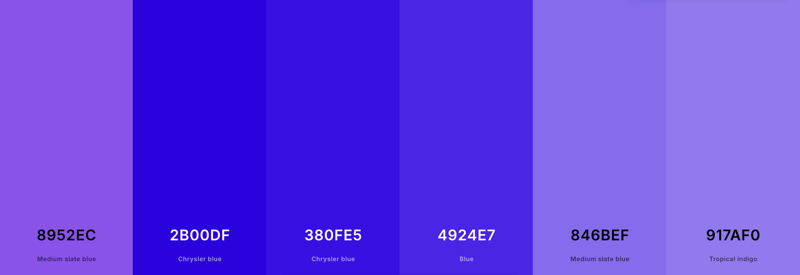

    
  
  # **Word Whiz**

  #### Word Whiz is a game where you can test your knowledge! Find out how many words you can guess correctly in a row. Click the correct word that corresponds with the definition to win.
  

  COLOR PALETTE            |  DEMO
:-------------------------:|:-------------------------:
   |  <video width=100% controls><source src="word-whiz-demo.mp4" type="video/mp4">DEMO Video</video>

## **KEY FEATURES:**
The game Word Whiz was inspired by the known website game called Wordle. It's key features are able to pull from multiple apis to find random words and definitions of that word.. It also has a leaderboard feature that allows you to figure out who is at the top eventhough its going to be using fake data.
## **HOW TO USE (Visual Studio Code)**

1. You will need to launch Word Whiz through your browser.

2. You will be directed to a title screen with the Play button on it, click the Play button.

3. Afterwards you will be in the game and when you are able to either get new words or try to guess the words.